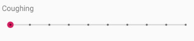
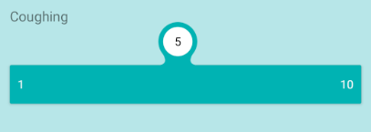
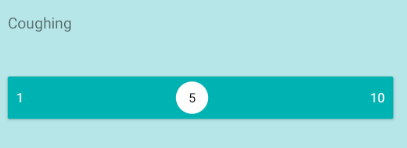
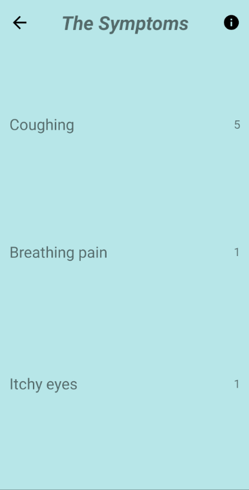
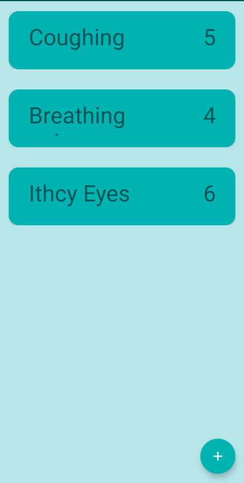
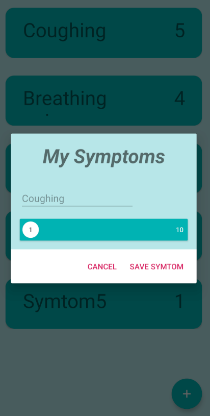

# Code Test Mobile Application Developer - Airmine

### Task 1 - User-interaction

Our users can enter their symptom levels (ex. coughing, breathing pain, itchy eyes) in our app, using a sliding bar for each symptom. The levels are set to 1 to 10 in our database, where 1 is the best (e.g. no coughing) and 10 is the worst. We save the historical symptom entries for each user in our database. 

Suggest some ways of presenting the historical symptom data to a user, write up the suggestion or use your preferred sketch/design tool.

##### My Idea: 

I went for my preferred design tool Adobe XD where i made some mockups.

  

 

### Task 2 - Simple demo app

Build a simple demo app, in react native or flutter **(Native Android - Kotlin was allowed as well)**:
The app should consist of 2 screens:

- Simple screen with UI for getting symptom information from the user
- Simple screen with a list displaying the result(s).

The app need to be hosted on github or similar.
Please provide instructions for how-to setup and run the app:
The app must be runnable on an Android or IOS emulator, or both.
If you have used any specific tools/libraries/approaches that you are fond of, please elaborate.
Feel free to start off from an available demo app.
No need for user login or backend/db to store results.
Do keep the code simple.

##### My Idea: 

First of all, I found this task to very vague, so I made some alternative solutions in my app. 

For getting user input in a easy way is to use a slider or a number picker like those in the calender apps. I went with the slider, here I made two different once; since the slider or seekbar in stock android is not very user friendly, as its feedback is lacking. The seekbar can have dots to mark each position but there is no number, so you will have to count to find etc the 7 position. 

The custom seekbar is a more modern one, with good feedback making it easier for user to figure out which number their on. 

 

Since I was only using 3 values / symtoms for this short demo I first created a "static list", before making an alternative using the native list - recyclerview with a lighly styled card with options to add more symtoms and values.

 

### Task 3 -  Notifications

We want to send our app users alerts/notifications when their personalized air quality or pollen forecasts look particularly bad. We need to identify users that should get the alerts, track who is alerted and monitor use of app based on alert history. 

The users and their personalized forecasts are stored in the backend (server side). 

How would you solve this? Please write up/sketch your suggested solution(s), with pros and cons.

##### My Idea: 

For this task Firebase (Cloud Messaging) can help simplify a lot of the requirements, you can make users enter their preference at setup or in settings and then send them to the server. Based on these preferences you can make a list or something with people that has ... 

Tracking who has been alerted can be done by saving them to a list or something or use firebase that manages that as well.

Monitor use of app is also a firebase thing or you can build in code for this as well. 

Cons:

- We have to check the status often and push warning based on them, resource demanding.
- Storing personal data - need added security
  - In terms of preference
  - User data and pattern of use

Pros:

- Complete control over the back end systems